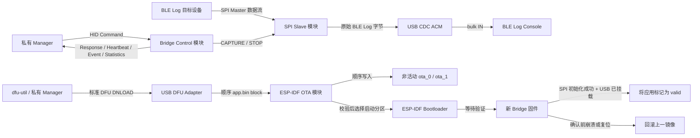
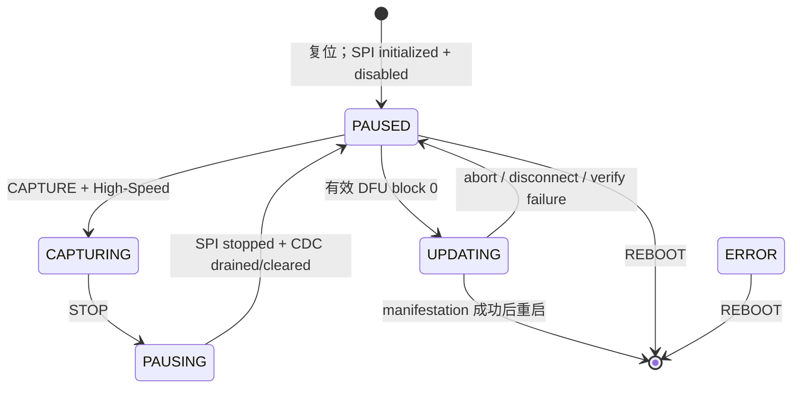
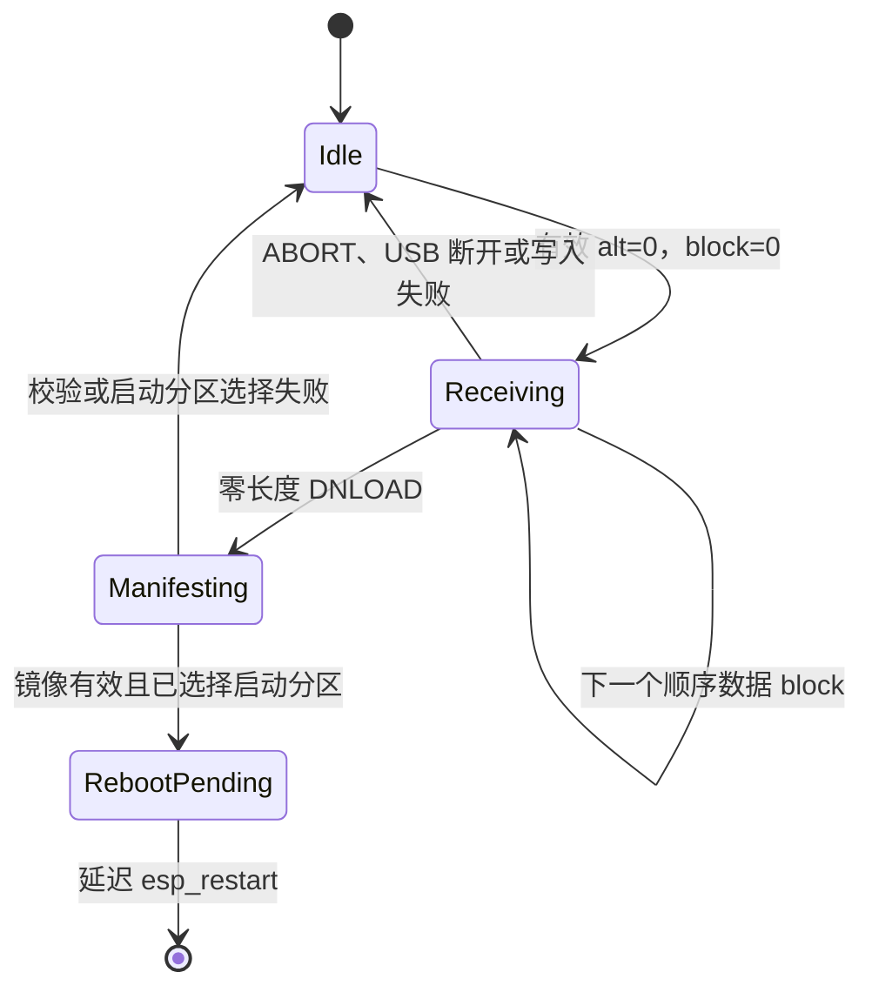

# ESP32-P4 BLE Log Bridge 固件设计提案

状态：设计已确认，等待实现；本目录仅包含待迁移的 prototype，尚无正式固件工程。

方案来源：[ble_log_bridge_manager 工作项 #1](https://gitlab.espressif.cn:6688/ble_tools/ble_log_bridge_manager/-/work_items/1)

## 1. 目标

构建一个 ESP32-P4 固件，实现以下能力：

1. 保留现有 SPI Slave 到 USB CDC 的 BLE Log 字节流；
2. 在同一个 USB 2.0 High-Speed OTG 接口上暴露标准 USB DFU Device Mode；
3. 使用 `esp_ota_*` 将普通 ESP-IDF 应用镜像写入非活动 OTA slot；
4. 仅在完整镜像校验通过后启动新镜像；
5. 如果新镜像无法初始化 SPI Bridge 或完成 USB 枚举，则自动回滚；
6. 通过 HID control/status 显式管理 capture、状态、Heartbeat、Event 和 Statistics；
7. 在 USB High-Speed 下持续转发 20 Mbit/s，不依赖 Windows `usbser` 性能；
8. 当一台 PC 同时连接多个相同 Bridge 时，仍可稳定选择其中指定设备。

常规升级路径采用应用层 USB DFU。ROM DFU 仅用于生产引导或最后的恢复手段，不属于日常设备管理流程。

## 2. 现有基线与约束

`components/ble_log_bridge_firmware/usb_spi_slave_bridge/` 中的现有原型：

- 目标芯片为 ESP32-P4；
- 使用 ESP32-P4 High-Speed USB 控制器；
- 通过 MOSI GPIO 4、SCLK GPIO 5 和 CS GPIO 6 接收 SPI2 Slave 数据；
- 预排队 32 个 DMA transaction，每个 receive buffer 为 10 KiB；
- 将每个完成的 SPI transaction 转发到 TinyUSB CDC ACM；
- 枚举为 Espressif VID `0x303A`、PID `0x4001`；
- 使用 2 MiB、单应用分区配置，无法支持本 OTA 设计。

正式固件基线固定为 [ESP-IDF `v6.0.2`](https://github.com/espressif/esp-idf/tree/v6.0.2) 和 [`espressif/esp_tinyusb` `2.0.1~1`](https://components.espressif.com/components/espressif/esp_tinyusb/versions/2.0.1~1)，并提交 Component Manager 生成的 dependency lock。`esp_tinyusb` 2.x 已提供 `TINYUSB_DEFAULT_CONFIG()`，但 composite configuration 包含 CDC、DFU 和 HID，仍必须显式提供完整的 Full-Speed、High-Speed、device qualifier 和 string descriptors。实现不保留 1.x compatibility branch。

目标硬件统一为具有 16 MiB SPI Flash 的 ESP32-P4 Bridge；官方 [ESP32-P4-Function-EV-Board hardware guide](https://docs.espressif.com/projects/esp-dev-kits/en/latest/esp32p4/esp32-p4-function-ev-board/user_guide.html) 也明确列出 16 MiB SPI Flash。两个 6 MiB OTA slots 属于该硬件 SKU 的长期 partition contract。

`components/ble_log_console` 中现有 PC 接收器通过 VID/PID `303A:4001` 识别 Bridge。Windows 上默认通过 `usbser` 打开 CDC 端口；Linux 和 macOS 上查找 bulk-IN endpoint。Windows 高吞吐部署可以由 Host 安装包将同一个 CDC function 改绑 WinUSB，并直接读取现有 bulk-IN endpoint `0x82`。因此，增加其他 interface 时必须保留 VID/PID、CDC interface 编号和 CDC bulk endpoint 地址。

## 3. 范围

### 3.1 包含范围

- 仅支持 ESP32-P4。
- SPI Slave 接收和 USB CDC 转发。
- 一个同时包含 CDC ACM、DFU Device Mode 和 HID control/status 的 USB composite configuration。
- 由 HID command 显式启动和停止 capture。
- HID command response、1 秒 Heartbeat、Capture Event 和每秒 Capture Statistics。
- High-Speed 下持续 20 Mbit/s 的 SPI-to-USB 数据路径。
- 仅支持下载的 DFU alternate setting 0。
- 将 `app.bin` 顺序传输至非活动 OTA application slot。
- Boot partition 选择、首次启动确认和 Bootloader 回滚。
- 每台设备稳定且唯一的 USB serial number。
- 基于 ESP-IDF 安全能力的开发配置和签名部署配置。

### 3.2 不包含范围

- 将 ROM DFU 作为常规升级路径。
- DFU Upload。
- 由主机指定 Flash 地址或分区。
- 通过 OTA 更新 Bootloader、partition table、NVS 或任意数据分区。
- 中断传输续传。
- 独立 recovery application 分区。
- USB 主机身份认证或链路加密。
- BLE Log Bridge Client/Server 或其他 PC 端设备管理代码。
- 经过认证或加密的 USB 控制协议。
- 独立 Vendor Bulk 日志 interface；高吞吐 Host 复用现有 CDC bulk-IN endpoint `0x82`。
- SPI HD Slave 和运行时 mode 切换；v1 仅报告固定 `SPI_SLAVE` mode。

如果产品后续明确要求“主应用无法启动时仍可恢复”，可以增加独立、固定且已签名的 recovery application。第一版有意不加入该能力，因为它会额外引入一个镜像、一个分区、一条启动路径和一套恢复策略。

## 4. 系统架构



`app_main` 之后只有四个运行时模块：

| 模块 | 调用方使用的接口 | 隐藏的实现 |
|---|---|---|
| `spi_bridge` | 初始化为 disabled；开始 capture；停止并 drain；返回统计快照 | SPI bus/slave 配置、DMA transaction 所有权、接收任务、CDC FIFO 写入、pressure 和 starvation 统计 |
| `bridge_control` | 初始化控制状态；处理 USB disconnect；允许或结束 DFU session | HID command/response、原子状态机、sequence 去重、Heartbeat、Capture Event、Capture Statistics、reboot delay |
| `usb_device` | 安装 composite USB device | descriptor 应用、稳定 serial 生成、TinyUSB 初始化、disconnect 协调 |
| `usb_ota` | 初始化并处理标准 DFU download | TinyUSB DFU callback、OTA session 状态、block 校验、`esp_ota_*`、DFU 状态映射、延迟重启 |

`app_main` 仅作为 composition root：

1. 初始化 `spi_bridge`，将默认 SPI Slave mode 保持 disabled；
2. 初始化 `bridge_control` 和 `usb_ota` 状态；
3. 最后安装 `usb_device`，确保 Bridge 就绪前主机请求不会进入设备。

USB descriptor 是较长的声明式数据，放在私有 `usb_descriptors.c` 中。`usb_device` 仅通过内部 `usb_descriptors_apply()` 使用它，不公开 descriptor 数据，也不引入通用 descriptor builder。

目标工程结构如下：

```text
components/ble_log_bridge_firmware/
├── DESIGN.md
├── .gitignore
├── CMakeLists.txt
├── dependencies.lock
├── sdkconfig.defaults
├── partitions.csv
└── main/
    ├── CMakeLists.txt
    ├── idf_component.yml
    ├── Kconfig.projbuild
    ├── app_main.c
    ├── bridge/
    │   ├── bridge_control.c
    │   ├── bridge_control.h
    │   └── bridge_protocol.h
    ├── spi/
    │   ├── spi_bridge.c
    │   └── spi_bridge.h
    └── usb/
        ├── usb_device.c
        ├── usb_device.h
        ├── usb_descriptors.c
        ├── usb_descriptors.h
        ├── usb_ota.c
        └── usb_ota.h
```

`main/` 仍是单个 ESP-IDF component；子目录只按运行模块提高 locality，不为每个目录增加一层浅 CMake component 或转发接口。

当前 `components/ble_log_bridge_firmware/usb_spi_slave_bridge/` 仅作为原型输入，不应成为需要长期维护的第二份固件。实现后删除该嵌套原型，只保留 `components/ble_log_bridge_firmware` 这一个正式工程位置。

## 5. USB 接口契约

### 5.1 设备身份

| 字段 | 值 | 原因 |
|---|---|---|
| VID | `0x303A` | 保留现有 Espressif 设备身份及 Console 发现逻辑 |
| PID | `0x4001` | 保留现有 Bridge 发现逻辑和 CDC 驱动关联 |
| Product | `USB-SPI-BRIDGE` | 避免产生用户可见的兼容性变化 |
| Serial | 从 ESP32-P4 Base MAC 派生的 12 位十六进制字符串 | 多个同型号设备并存时可稳定选择指定 Bridge |
| `bcdDevice` | 固件 release major/minor 的 BCD 表示，初始为 `0x0100` | 无需 Vendor 协议即可发现粗粒度版本 |
| USB version | `0x0200` | USB 2.0 device |

Serial 字符串必须在 OTA 前后保持不变，并且每块开发板都不同。原型中 `123456` 这类构建期常量不可接受，因为 `dfu-util` 和未来的私有 Manager 需要在 USB 重新枚举后继续选择同一台 Bridge。

### 5.2 Composite configuration

设备仅提供一个 configuration，共四个 interface：

| Interface | 功能 | Alternate setting | Endpoint |
|---|---|---|---|
| 0 | CDC ACM control，位于 CDC IAD 中 | 0 | notification IN `0x81` |
| 1 | CDC ACM data | 0 | bulk OUT `0x02`、bulk IN `0x82` |
| 2 | DFU Device Mode | 仅 0：`Application Firmware` | 无；DFU 使用 endpoint 0 control transfer |
| 3 | HID control/status，vendor-defined usage page | 0 | interrupt OUT `0x03`、interrupt IN `0x83` |

Device class/subclass/protocol 保持 Miscellaneous/Common/IAD，使操作系统继续正确绑定两个 CDC interface。

Full-Speed 和 High-Speed descriptor 的总长度必须一致，仅在 USB 速率要求不同的字段上存在差异：

- CDC bulk 最大 packet：Full-Speed 为 64 bytes，High-Speed 为 512 bytes；
- HID interrupt 最大 packet：两种速率均为 64 bytes；
- DFU transfer size：两种速率均为 4096 bytes。

同时提供匹配的 device qualifier。`esp_tinyusb` 根据提供的 FS 和 HS descriptor 生成 other-speed response。

`esp_tinyusb` 2.x 通过运行时 `tinyusb_config_t.port = TINYUSB_PORT_HIGH_SPEED_0` 选择 ESP32-P4 HS controller，不再使用旧版 `CONFIG_TINYUSB_RHPORT_HS` Kconfig。连接到 Full-Speed Host/hub 时由同一 controller 协商降速并使用 FS descriptor。

DFU functional descriptor 配置如下：

- `bmAttributes = DFU_ATTR_CAN_DOWNLOAD`；
- 不包含 `DFU_ATTR_CAN_UPLOAD`；
- 不包含 `DFU_ATTR_MANIFESTATION_TOLERANT`，因为 manifestation 成功后设备会复位；
- 仅有一个 alternate setting；
- `wTransferSize = 4096`；
- `bcdDFUVersion = 1.1`，由 TinyUSB 的 `TUD_DFU_DESCRIPTOR` 生成。

不使用 DFU Runtime interface，也不会重启进入 ROM DFU。正常应用本身就是 DFU target。

DFU 和 HID 都不增加 bulk-IN endpoint，因此现有非 Windows BLE Log Console 仍只会找到 CDC bulk-IN endpoint `0x82`。CDC 保持 interface 0/1，也可以避免改变 Windows 上的 CDC interface 身份。

### 5.3 主机驱动策略

- Linux：主机安装包提供所需 udev 权限规则。
- macOS：`dfu-util` 通过 libusb 访问 interface 2。
- Windows：默认 CDC 路径绑定 `usbser`；持续 20 Mbit/s 的高吞吐部署由 Host 安装包将同一个 CDC function 改绑 WinUSB，并直接读取 bulk-IN endpoint `0x82`。两种驱动不会同时拥有同一个 CDC function。interface 2 也由 Host 安装包配置为 WinUSB，供 `dfu-util` 使用。

第一版暂不加入 Microsoft OS descriptor，也不由固件强制 CDC function 自动绑定 WinUSB。Host 安装包负责选择 `usbser` 或 WinUSB；开发阶段可以使用 Zadig 验证，但它不属于正式部署流程。只有当 Host 驱动初始化成为实际运维问题时，再评估 OS descriptor。

### 5.4 HID reports

HID 使用 vendor-defined usage page。HID class 提供 report 边界、长度和跨平台驱动，但 CAPTURE 等业务语义由本固件定义。每个 Report ID 的长度和字段语义发布后保持不变；未来不兼容布局使用新的 Report ID，不修改旧 Report。

| Report ID | 方向 | 定位 | 主要字段 |
|---|---|---|---|
| 1 `CommandV1` | Host → Device | 单个控制请求 | sequence、command |
| 2 `ResponseV1` | Device → Host | command 的唯一最终响应 | sequence、command、result、state、mode、USB speed、capture ID、uptime；STOP 时另含最终 byte accounting |
| 3 `HeartbeatV1` | Device → Host | 1 秒 best-effort liveness | state、mode、capture ID、uptime |
| 4 `CaptureEventV1` | Device → Host | pressure、drop、SPI/DMA error 和 starvation 的最新快照 | capture ID、event/flags、FIFO 水位、可用 RX transaction、错误与累计值 |
| 5 `CaptureStatisticsV1` | Device → Host | CAPTURING 期间每秒 best-effort 累计快照 | capture ID、SPI/USB bytes、transaction counters、FIFO 水位和 starvation counters |

所有 reports 必须容纳在一个 64-byte HID interrupt packet 内。Report ID 本身选择固定 schema，因此 v1 不在每个 payload 中重复携带 protocol version。只有未来出现 Manager 与固件独立演进且必须协商的真实需求时，才增加只在连接时读取的 Capabilities Feature Report。

v1 commands：

| Command | 允许状态 | 成功结果 |
|---|---|---|
| `CAPTURE` | `PAUSED` 且 USB 为 High-Speed | 清零 session counters，分配非零 capture ID，启动 SPI，进入 `CAPTURING` |
| `STOP` | `CAPTURING` | 进入 `PAUSING`；完成停止和 drain 后返回最终 Response 并进入 `PAUSED` |
| `GET_STATUS` | 除重启过程外的任意状态 | 返回当前 state、固定 `SPI_SLAVE` mode、USB speed、capture ID 和 uptime |
| `REBOOT` | `PAUSED` 或 `ERROR` | 先返回 Response，再延迟调用 `esp_restart()` |

Result 至少区分 `OK`、`UNSUPPORTED_COMMAND`、`INVALID_STATE`、`BUSY`、`UNSUPPORTED_USB_SPEED`、`SEQUENCE_CONFLICT`、`INTERNAL_ERROR` 和 `STOP_DRAIN_TIMEOUT_DROPPED`。Full-Speed 下 CAPTURE 必须返回 `UNSUPPORTED_USB_SPEED`；控制、Heartbeat、状态查询、REBOOT 和 DFU 仍可使用。

Host 同时只能有一个 outstanding command。Device 缓存最后一个 sequence、command 和 Response；完全相同的重试只重发 Response，不重复执行。相同 sequence 携带不同 command 返回 `SEQUENCE_CONFLICT`。多进程控制仲裁由 Host 单实例/OS lock 保证，固件不实现 lease 或 owner token。

调度优先级为：

```text
Response > Capture Event > Heartbeat > Capture Statistics
```

Heartbeat 和 Statistics 不建立积压 queue；endpoint 忙时跳过本周期。Capture Event 使用 sticky state 和 dirty flag 合并重复变化，发送最新快照。正常状态下 Host 连续 3 秒没有收到 Heartbeat 或 Response 即判定连接异常；`UPDATING` 期间 Heartbeat 仅 best-effort，Manager 暂停该 3 秒判定并改用 DFU control result 判断进度。

### 5.5 Bridge 运行状态



设备复位后始终进入 `PAUSED`；该状态不写 NVS。v1 mode 由构建固定为 `SPI_SLAVE`，Heartbeat 仍报告 mode，但不提供 SET_MODE。SPI HD Slave adapter 和安全 teardown 真正存在时，再增加运行时 mode switching。

## 6. DFU 到 OTA 的更新 session

### 6.1 状态模型



OTA session 持有以下状态：

- 当前状态；
- target partition 指针；
- OTA handle 是否有效；
- 下一个预期 block number；
- 已接收总字节数；

必须始终满足以下不变量：

1. 第一个 block 仅在 Bridge state 为 `PAUSED` 时接受；`CAPTURING` 或 `PAUSING` 时返回 `DFU_STATUS_ERR_NOTDONE`；
2. OTA handle 仅在 Receiving 或 Manifesting 状态有效，并且必须且只能由 `esp_ota_end()` 或 `esp_ota_abort()` 关闭一次；
3. target 始终由 `esp_ota_get_next_update_partition(NULL)` 选择，主机不能指定；
4. target 永远不是当前运行分区；
5. `received_bytes` 永远不超过 target partition 大小；
6. 仅当 `esp_ota_write()` 成功后，预期 block 才前进；
7. 仅当 `esp_ota_end()` 成功后，才能调用 `esp_ota_set_boot_partition()`。

### 6.2 第一个数据 block

收到第一个非空 `DFU_DNLOAD` callback 时：

1. 要求 `alt == 0`；
2. 要求 `block_num == 0`；
3. 要求 `0 < length <= 4096`；
4. 通过 `bridge_control` 原子地要求 `PAUSED -> UPDATING`；其他 Bridge state 拒绝该请求；
5. 使用 `esp_ota_get_next_update_partition(NULL)` 选择非活动 OTA slot；
6. 验证存在可用的 OTA application partition；
7. 使用 `esp_ota_begin(target, OTA_WITH_SEQUENTIAL_WRITES, &handle)` 开始增量擦除和写入；
8. 使用 `esp_ota_write()` 写入 block；
9. 仅在写入成功后，通过 `tud_dfu_finish_flashing(DFU_STATUS_OK)` 报告成功。

`OTA_WITH_SEQUENTIAL_WRITES` 避免在首次响应前擦除整个 slot，并且与 DFU 的顺序数据流一致。

步骤 5–8 任一失败都要关闭已创建的 handle、清空 OTA session，并将 Bridge state 恢复为 `PAUSED`。DFU callback 不隐式执行 STOP；Manager 必须先通过 HID STOP 并收到最终 Response。刚复位的设备本来就是 `PAUSED`，因此普通 `dfu-util` 仍可直接升级。

### 6.3 后续数据 block

收到每个后续非空 block 时：

1. 要求当前存在活动的 Receiving session；
2. 要求 `alt == 0`；
3. 要求 `block_num == expected_block`；
4. 写入前拒绝 `received_bytes + length > target->size`；
5. 调用 `esp_ota_write()`；
6. 仅在成功后更新计数器。

乱序、重复、跳号、超分区或非零 alt 的数据不得写入 Flash。

TinyUSB manifestation callback 会提供 alternate setting，但不会提供最终零长度请求的 block number。因此，固件校验所有带数据的 block，但不声称校验当前 TinyUSB 接口未提供的最终 block number。

### 6.4 Manifestation

收到零长度 DNLOAD manifestation callback 时：

1. 要求 `alt == 0`、存在活动 session，且已写入至少一个字节；
2. 调用 `esp_ota_end(handle)`，完成 Flash Encryption 收尾，并校验完整 ESP 镜像以及启用 Secure Boot 时的签名；
3. 校验成功后调用 `esp_ota_set_boot_partition(target)`；
4. 在断开连接前向主机报告最终 DFU 状态；
5. 保持 Bridge state 为 `UPDATING`；
6. 启动一次性 `esp_timer`，确保最终 control response 有时间到达主机后再调用 `esp_restart()`。

初始重启延迟为 500 ms。该参数受硬件和主机兼容性影响，应保持可配置，以便在不同 USB hub 和操作系统上测试。

如果 `esp_ota_end()` 失败，其 handle 已经失效，不能再次调用 abort。如果 boot partition 选择失败，当前启动配置继续生效。两类失败都不能启动候选镜像。

### 6.5 Abort 和断开连接

在 Receiving 状态下，`tud_dfu_abort_cb()` 和 USB unmount 执行相同清理流程：

1. abort 有效的 OTA handle；
2. 清空 session 元数据；
3. 将 Bridge state 恢复为 `PAUSED`。

DFU DETACH 请求不会使设备重启进入 ROM DFU。在这个始终存在的 DFU Device Mode 中，Idle 状态下忽略 DETACH；存在活动传输时，将其视为取消操作。

Boot partition 选择成功后，不允许取消操作撤销结果。`RebootPending` 状态下断开连接或掉电，只会使设备在下次启动时尝试已选择的新镜像。

第一版不支持断点续传，也不增加固件侧 inactivity watchdog。主机取消操作时必须发送 DFU ABORT；重试前必须重置 DFU 状态。只有当真实 Manager 崩溃导致仍供电设备频繁卡在 DFU session 时，才增加基于 inactivity 的强制 USB reset。

### 6.6 DFU 状态映射

| 条件 | DFU status |
|---|---|
| 非零 alternate 或无可用 target | `DFU_STATUS_ERR_TARGET` |
| 首字节非法或镜像格式错误 | `DFU_STATUS_ERR_FILE` |
| Bridge 非 `PAUSED`，或 block 跳号、重复、乱序 | `DFU_STATUS_ERR_NOTDONE` |
| 镜像超过 slot 大小 | `DFU_STATUS_ERR_ADDRESS` |
| `esp_ota_write()` 内部增量擦除或写入失败 | `DFU_STATUS_ERR_WRITE` |
| `esp_ota_end()` 镜像或签名校验失败 | `DFU_STATUS_ERR_VERIFY` |
| Boot partition 选择失败 | `DFU_STATUS_ERR_FIRMWARE` |
| 未映射的内部失败 | `DFU_STATUS_ERR_UNKNOWN` |

每个启动 TinyUSB flashing operation 的 callback 都必须且只能调用一次 `tud_dfu_finish_flashing()`。

生成 dependency lock 后必须记录并检查实际解析的 TinyUSB transitive version 对原始 `SET_INTERFACE` 的行为。无论 stack 是否先行校验，固件都拒绝所有 `alt != 0` 的 DFU data callback，正常的 `dfu-util -a 1` 枚举也找不到该 alternate。如果 USB 一致性要求原始非零 `SET_INTERFACE` 请求本身必须 STALL，而锁定版本没有做到，应升级或修复 TinyUSB，不在固件中再增加一套旁路协议。

### 6.7 Poll 时序

`tud_dfu_get_timeout_cb()` 用于告知主机再次 poll 前应等待多久。初始值为：

- 数据 block：10 ms；
- Manifestation：1000 ms。

这些值只是调优起点，不是正确性超时。必须在开启 Secure Boot 和 Flash Encryption 的真实 Flash 上测量：每个 block 的等待值过大会直接降低吞吐，过小则会造成不必要的主机 poll。在实测证明有必要前，只保留这两个可配置参数，不提前引入异步写入 queue。

## 7. Capture 与 BLE Log 数据路径

### 7.1 SPI DMA ownership

v1 固定使用 SPI Slave mode、MOSI GPIO 4、SCLK GPIO 5 和 CS GPIO 6。启动时分配 128 个 transaction，每个 DMA receive buffer 为 2 KiB；发送端必须保证单个 CS transaction 不超过 2 KiB。SPI driver 初始化成功后立即 disable，并在 `PAUSED` 中保持 driver 和 DMA pool 存活。

正式数据路径不得延续 prototype 的 partial-drop 行为。对每个 `spi_slave_get_trans_result()` 返回的完整 transaction：

1. 检查 TinyUSB CDC TX FIFO 的 available bytes；
2. 只有 available 足以容纳整个 transaction 时才一次性 enqueue；
3. 空间不足时保留该 DMA buffer ownership，不 requeue；
4. 等待 CDC TX-complete 通知后重试，不使用会限制 20 Mbit/s 吞吐的固定 polling loop；
5. 整个 transaction 被 FIFO 接受后才重新 queue 给 SPI driver。

该路径不复制 payload 到额外 ring buffer。128 × 2 KiB DMA pool 与 32 KiB CDC TX FIFO 提供 288 KiB、即约 118 ms 的设备侧 buffering。32 KiB 是当前 TinyUSB `tu_fifo_t` 的最大合法 depth；继续增加 ESP32-P4 RAM 不能突破该实现上限。全部 DMA-capable allocations 必须在启动时检查；任一分配或 queue 操作失败都属于 SPI 初始化失败，不能用 `assert()` 代替可诊断错误，也不能把新 OTA 镜像标 valid。

### 7.2 CAPTURE

CAPTURE 仅在以下条件全部满足时成功：

1. Bridge state 为 `PAUSED`；
2. USB negotiated speed 为 High-Speed；
3. SPI driver、128 个 descriptors 和 DMA buffers 均已就绪；
4. 没有活动 DFU session。

成功时 Device 递增非零 `uint32_t capture_id`，清零 session counters，enable SPI peripheral 并进入 `CAPTURING`。capture ID 在复位后从 1 重新开始，溢出时跳过 0。Host 必须先打开数据 interface、预提交 bulk reads，再发送 CAPTURE；由于 HID 和 bulk-IN 是不同 endpoints，Host 应在收到 CAPTURE Response 前暂存已经到达的本 session bytes，失败时丢弃这些 bytes。

### 7.3 STOP 与 PAUSING

STOP 的 capture 边界定义为：

> STOP 被 `bridge_control` task 执行前，已经成功写入 USB CDC TX FIFO 的 bytes 属于本 session；SPI driver、DMA transaction 或 SPI task 中尚未进入 TX FIFO 的数据不属于本 session，并被丢弃。

HID callback 不直接修改 state 或操作 SPI；它只向 `bridge_control` task 投递 command。该 task 独占 CAPTURE/STOP state transition，使 STOP 与 CDC enqueue 的先后顺序唯一且可测试。

STOP 流程：

1. `CAPTURING -> PAUSING`，阻止任何新的 SPI payload 进入 CDC TX FIFO；
2. disable SPI peripheral，丢弃当前、已完成但未 enqueue 和待处理的 SPI transactions；
3. drain 已在 CDC TX FIFO 中的 bytes，初始超时为 2 秒；
4. 正常 drain 完成后进入 `PAUSED`；
5. 超时时调用 TinyUSB `tud_cdc_n_write_clear()` 丢弃剩余 FIFO，进入 `PAUSED`，Response result 为 `STOP_DRAIN_TIMEOUT_DROPPED`；
6. 发送延迟的 STOP Response。该 Response 本身就是 STOPPED，不增加另一个 Report ID。

STOP Response 返回 capture ID、`expected_host_bytes`、`stop_discarded_bytes` 和 `locally_dropped_bytes`，其中 `expected_host_bytes = usb_queued_bytes - stop_discarded_bytes`。Host 在收到 Response 后仍保持 bulk reads，直到本 session 实收 bytes 等于 `expected_host_bytes`，再取消剩余空 transfers。不能用 HID Response 与 bulk callback 的观察顺序推断尾部已经到达，也不得向原始 BLE Log stream 注入结束 marker。

正在接收的 SPI transaction 被 STOP 丢弃属于已定义边界，不计入无法准确测量的 dropped bytes；transaction statistics 使用 `aborted_transactions` 记录。必须用硬件 spike 覆盖 CS transaction 的不同阶段，验证 `spi_slave_disable()` 后重新 CAPTURE 不会续接旧 DMA 内容；若 ESP-IDF v6.0.2 的公开行为不足以保证这一点，再设计经过验证的 driver reinitialize 流程或 READY GPIO，不调用未公开的 queue cancellation interface。

### 7.4 Disconnect

USB unmount 时 Host 已无法接收尾部数据，因此不执行 2 秒 drain：立即停止 SPI、清除 CDC TX FIFO、终止活动 OTA session，并进入 `PAUSED`。重新枚举后必须由 Host 再次发送 CAPTURE。断开前正在进行的 command 不承诺 Response。

### 7.5 Pressure、统计与完整性

CDC FIFO 使用率达到 90% 时置 pressure；降到 70% 以下时恢复。SPI DMA backlog 以“仍可供 master 使用的 receive transactions”为准：剩余不超过 12 个时置 pressure，恢复到至少 38 个时清除。状态变化通过 Capture Event 发送。

每秒 Capture Statistics 至少包含：

- `spi_received_bytes`；
- `usb_queued_bytes`；
- `locally_dropped_bytes`；
- completed、zero-length、non-byte-aligned、aborted transaction counts；
- SPI/DMA error count；
- RX starvation count 和 duration；
- 当前及 session peak CDC FIFO used percentage（`uint8_t`，为使包含 Report ID 的整个 report 保持在单个 64-byte HID packet 内）；Capture Event 仍报告精确 used bytes。

byte totals 使用 `uint64_t`；其他 counters 使用饱和计数，不回绕。统计在每次 CAPTURE 成功时清零。

若 receive transactions 耗尽，固件只能确认当前没有 buffer，不能知道 master 是否以及发送了多少 bytes。此时发送 `RX_STARVATION` Event、累计次数和持续时间，将 session 标为完整性未知；buffer 恢复后继续 capture，保留后续日志，不伪造 dropped bytes，也不自动结束 session。

固件不得向 CDC BLE Log 流注入控制、OTA、Heartbeat、Event 或 Statistics bytes；该 endpoint 始终只承载原始 BLE Log。

## 8. 分区与启动契约

支持的固件构建使用自定义 OTA partition table，并且不设置 factory application：

```csv
# Name,    Type, SubType, Offset, Size, Flags
nvs,       data, nvs,     0x9000, 64K,
otadata,   data, ota,             8K,
ota_0,     app,  ota_0,            6M,
ota_1,     app,  ota_1,            6M,
```

目标硬件统一为 16 MiB Flash，slot layout 固定。必须满足以下约束：

- `otadata` 为 8 KiB；
- 至少有两个 OTA application slot；
- 两个 OTA slot 大小相同；
- 每个 slot 都能容纳最大签名应用镜像及预留增长空间；
- 应用镜像不能写出所选 slot；
- 常规 USB OTA 永远不修改该 partition table。

在包含 Bootloader、partition table、NVS、对齐空间和 OTA metadata 后，两个 6 MiB slots 使用已确认的 16 MiB Flash SKU。原型的 2 MiB single-app partition table 不可复用。启动时若检测到的 Flash 容量与 16 MiB 构建契约不一致，必须报告初始化失败，不能继续把错误 partition assumption 当成可用设备。

由于本 DFU 路径有意禁止更新 partition table，因此分区布局是长期设备兼容性契约。应在批量 bootstrap 前确定 slot 大小，而不是按照当前约 250 KiB 的原型镜像做最小化配置。

必须启用以下配置：

```text
CONFIG_PARTITION_TABLE_CUSTOM=y
CONFIG_BOOTLOADER_APP_ROLLBACK_ENABLE=y
CONFIG_ESPTOOLPY_FLASHSIZE_16MB=y
CONFIG_TINYUSB_CDC_ENABLED=y
CONFIG_TINYUSB_HID_COUNT=1
CONFIG_TINYUSB_DFU_MODE_DFU=y
CONFIG_TINYUSB_DFU_BUFSIZE=4096
CONFIG_TINYUSB_CDC_TX_BUFSIZE=32768
CONFIG_BRIDGE_SPI_TRANSACTION_SIZE=2048
CONFIG_BRIDGE_SPI_QUEUE_DEPTH=128
CONFIG_BRIDGE_STOP_DRAIN_TIMEOUT_MS=2000
```

## 9. 首次启动确认与回滚

Bootloader 以 `ESP_OTA_IMG_PENDING_VERIFY` 状态启动新选择的镜像。

只有同时满足以下两个条件，才确认新镜像有效：

1. SPI Slave 初始化成功；
2. Composite USB device 已达到 TinyUSB mounted/configured 状态。

初始化顺序保证 TinyUSB 可能 mount 之前，SPI 条件已经成立。USB mount callback 检查当前运行分区状态，并且只在状态为 `ESP_OTA_IMG_PENDING_VERIFY` 时调用 `esp_ota_mark_app_valid_cancel_rollback()`。

这个健康门槛证明两个对外有用的 Bridge 路径均已完成初始化，但不要求 BLE Log 目标设备正在实际发送数据。如果要求出现真实 SPI 流量，目标设备未上电时会导致健康的 Bridge 错误回滚。

如果新镜像在 USB mount 和确认前崩溃、触发 watchdog、初始化失败或复位，Bootloader 会回滚到上一个有效 slot。设备在没有 USB Host 的情况下上电会保持 pending；如果从未完成枚举就再次复位，发生回滚是预期行为，因为其唯一管理接口尚未被证明可用。

## 10. 掉电行为

| 故障点 | 持久化结果 | 下次启动或运行结果 |
|---|---|---|
| OTA 开始前 | 无变化 | 当前镜像继续运行 |
| 擦除或写入非活动 slot 时 | 仅留下不完整的非活动镜像 | 当前镜像仍可启动 |
| 最后一个 block 后、`esp_ota_end()` 成功前 | 候选镜像未被选择 | 当前镜像继续运行 |
| 镜像无效、截断、随机、芯片错误或签名错误 | 校验失败，候选镜像未被选择 | 当前镜像运行，Bridge 回到 `PAUSED` |
| `esp_ota_end()` 后、选择 boot partition 前 | 存在有效镜像数据，但未被选择 | 当前镜像继续运行 |
| 更新冗余 `otadata` 时 | ESP-IDF 选择有效的 metadata sector | 旧或新启动选择至少一个保持有效 |
| 选择 boot partition 后、延迟重启前 | 新镜像已被选择 | 新镜像以 pending verification 状态启动 |
| 新镜像确认前崩溃或复位 | Bootloader 将其标记为本次不可继续使用 | 上一个有效镜像启动 |
| 新镜像确认后 | 新镜像已标记 valid | 后续复位继续运行新镜像 |

固件不自行实现 journal、checksum、签名算法、加密层或回滚 metadata。这些职责全部交给 ESP-IDF。

## 11. 安全模型

标准 DFU 不认证 PC 或操作人员身份。任何能够物理访问 USB 的人都可以请求下载固件。

因此，部署安全依赖 ESP-IDF：

- Secure Boot V2 保证只接受正确签名的应用镜像；
- Flash Encryption 保护静态数据，由 `esp_ota_write()` 处理；
- DFU Upload 始终禁用。

v1 不启用 anti-rollback。提高 eFuse `secure_version` 可能同时使旧 OTA slot 不再是合法 rollback target；在没有发布、fallback slot 和 eFuse 推进策略前，不用“禁止降级”破坏已验证的自动回滚。只有出现必须封禁的已签名漏洞版本时，才单独设计 anti-rollback rollout。

HID control 与标准 DFU 一样不认证 Host。第一版接受“物理 USB 访问即可信”；任何能访问 USB 的 Host 都可以 CAPTURE、STOP、GET_STATUS 或 REBOOT。固件不实现隐藏 command、共享密码或 challenge-response。

Flash Encryption 不会加密 USB 线上的传输。如果未来必须认证操作人员或保护传输机密性，标准 DFU 就不适合作为承载该能力的接口；应改用带认证的 Vendor 协议，或在应用中增加启用 DFU 前的授权步骤。不要在 DFU 模块中重复实现密码学。

可以先在未签名开发板上验证 USB 稳定性和掉电行为。只有在真实、已启用 eFuse 的开发板上验证 Secure Boot 和错误签名镜像拒绝行为后，受管 QA 部署才能将 USB OTA 视为可信升级路径。

## 12. 主机接口契约

主机发送普通 application binary，而不是 ROM DFU archive：

```bash
idf.py build
dfu-util -l
dfu-util -d 303a:4001 -S <bridge-serial> -a 0 \
  -D build/ble_log_bridge_firmware.bin
```

不得发送为 ROM DFU 生成的 `build/dfu.bin`。该格式可能包含多个镜像和多个 Flash 地址，而本接口只接受一个顺序 ESP application image。

当同时存在多个 Bridge 时，稳定 USB serial 是必需条件。私有 Manager 负责：

1. 通过 HID Heartbeat/GET_STATUS 确认指定 serial 的设备当前为 `PAUSED`；若正在 capture，则发送 STOP 并等待最终 Response；
2. 停止 Host capture 数据处理，但在 STOP 的 `expected_host_bytes` 对账完成前保持 bulk reads；
3. 对 interface 2、alternate 0 发起 DFU；
4. DFU 期间暂停 Heartbeat 3 秒离线判定；
5. 等待同一 serial 断开并重新枚举；
6. 确认设备回到 `PAUSED` 并恢复 Heartbeat；
7. 上报 `dfu-util` 结果和启动后设备是否重新出现。

### 12.1 Windows 高吞吐接收

固件保持 CDC interface 0/1 和 bulk-IN endpoint `0x82` 不变。Windows 高吞吐接收不增加第二个 Vendor Bulk interface，而是由 Host 安装包将现有 CDC function 绑定 WinUSB；Host application 直接读取 interface 1 的 endpoint `0x82`。若部署选择 `usbser`，同一固件仍可通过 COM 接收，但该路径不作为持续 20 Mbit/s 的吞吐保证。

Host 接收器必须使用异步、预提交的 bulk read pipeline，而不是“读取一块、处理完成后再读取下一块”的同步循环：

1. 单个 transfer buffer 初始覆盖约 10 ms 输入，即在 20 Mbit/s 下约 25 KiB；
2. 同时预提交约 10 个 transfer，使 Host 侧 outstanding USB buffer 总量覆盖约 100 ms，即约 250 KiB；
3. transfer callback 只移交已完成 buffer，并立即补交新的空 buffer；
4. USB I/O、BLE Log parsing、文件写入和 UI 更新必须位于不同执行路径，parser 不得阻塞 transfer 重提交；
5. Host 下游 queue 必须有固定上限；长期处理不过来时停止 capture，不得无限分配内存；
6. 具体 transfer 大小和数量由 Windows、WinUSB、代表性 hub 与线材实测调优，但总覆盖时间不得在没有等价测试证据时低于 100 ms。

该设计参考 DSView 的 stream-mode Host pipeline：单 transfer 约覆盖 10 ms，并预提交足以覆盖约 100 ms 的多个 libusb bulk transfer。参考实现见 [`get_buffer_size()` / `get_number_of_transfers()`](https://github.com/DreamSourceLab/DSView/blob/master/libsigrok4DSL/hardware/DSL/dsl.c#L2070-L2158) 和 [`dsl_start_transfers()`](https://github.com/DreamSourceLab/DSView/blob/master/libsigrok4DSL/hardware/DSL/dsl.c#L2493-L2556)。

100 ms 是 Host 已提交 USB read buffer 的覆盖时间，不代表固件必须再增加独立的 250 KiB ring buffer。固件使用 128 × 2 KiB SPI DMA transaction pool 和 32 KiB TinyUSB CDC TX FIFO，并通过 FIFO pressure、DMA backlog、local drop 和吞吐统计验证设备侧 buffering。只有实测证明 Host 已持续预提交 read、但该 zero-copy backlog 仍因调度抖动耗尽时，才增加新的设备端 buffer。

### 12.2 Capture Host 顺序

Host 必须按以下顺序启动 capture：

1. 打开 HID interface，确认 Heartbeat 和 `PAUSED`；
2. 打开 CDC data function；Windows 高吞吐部署使用 WinUSB；
3. 预提交约 100 ms 的异步 bulk reads；
4. 发送 CAPTURE；
5. 暂存 CAPTURE Response 前到达的 bulk bytes；成功后按返回的 capture ID 归入本 session，失败则丢弃；
6. 持续读取 Heartbeat、Capture Event 和每秒 Statistics。

停止 capture：

1. 在 bulk reads 仍持续提交时发送 STOP；
2. Heartbeat 为 `PAUSING` 时继续消费 bulk data；
3. 收到最终 STOP Response 后，按 `expected_host_bytes` 对账；
4. 达到该 byte count 后取消剩余空 bulk transfers；
5. 若 result 为 `STOP_DRAIN_TIMEOUT_DROPPED`、`locally_dropped_bytes != 0`、发生 `RX_STARVATION` 或其他完整性 Event，将该 session 标记为不完整。

HTTP Client/Server 管理平面和固件包分发仍位于本仓库范围之外。

## 13. 存量设备 bootstrap 约束

所有当前运行 single-app 原型固件的开发板，都需要执行一次 bootstrap 烧录，并同时写入以下内容：

- 支持 OTA rollback 的 Bootloader 配置；
- 新的双 slot partition table；
- 第一个支持 USB OTA 的 Bridge application。

现有固件没有 DFU interface，无法通过 USB 安装该布局；本方案中的应用层 DFU 也有意禁止更新 Bootloader 和 partition table。因此，现有 QA 开发板仍需要进行最后一次 UART、USB-Serial-JTAG 或生产烧录。完成这次 bootstrap 后，后续应用更新才可以只使用 USB 2.0 HS 接口。

未来修改 partition table 时也受同一约束。批量 bootstrap 后应避免再次修改分区布局。

## 14. 验证契约

只有当实现能在真实硬件上证明以下可观察行为时，本设计才算完整落地。

### 14.1 USB 与兼容性

- VID/PID 保持 `303A:4001`。
- CDC 保持 interface 0/1 和现有 endpoint 地址。
- DFU 使用 interface 2，并且仅提供 `alt=0: Application Firmware`。
- HID control/status 使用 interface 3、interrupt OUT `0x03` 和 interrupt IN `0x83`；没有第二个 bulk-IN endpoint。
- FS、HS、qualifier、configuration length 和 other-speed descriptor 通过枚举检查。
- 现有 BLE Log Console 在 Windows、Linux 和 macOS 上仍能正常采集。
- Windows WinUSB direct-bulk 路径通过现有 endpoint `0x82` 持续接收至少 20 Mbit/s，Host 预提交约 100 ms 的 transfer buffer，并且固件 local dropped bytes 保持为零。
- 对照记录 Windows `usbser`/COM 与 WinUSB direct-bulk 的持续吞吐、Host read gap、FIFO pressure 和首次 local drop 点；仅 WinUSB direct-bulk 路径承担 20 Mbit/s 保证。
- Full-Speed 下 CAPTURE 返回 `UNSUPPORTED_USB_SPEED`，但 HID、Heartbeat、GET_STATUS、REBOOT 和 DFU 可用。
- 同时连接的两个 Bridge 具有不同且稳定的 serial，并可被独立选择。
- DFU Upload、`dfu-util -a 1` 和基于地址的 DfuSe 操作均不能写入 Flash。

### 14.2 Capture 与控制

- 复位后 Heartbeat 报告 `PAUSED`、`SPI_SLAVE` 和非递减 uptime；CAPTURE 前 SPI 不接收数据。
- CAPTURE 成功分配非零 capture ID、清零 session counters，并在 High-Speed 下持续接收 20 Mbit/s。
- 128 × 2 KiB DMA pool 在目标板上分配成功；任一分配失败可诊断且阻止健康确认。
- CDC FIFO 90%/70% 和 DMA transaction 12/38 pressure transition 产生对应 Event，且事件不会形成无界 queue。
- 使用已知输入验证每秒 Statistics 的 SPI received、USB queued 和 local drop counters；临时仍由 DMA buffer 持有的 transaction 不得被误算为已 queue 或已 drop，无法观测的 RX starvation 不伪造 dropped bytes。
- STOP 在 CS transaction 的不同阶段执行；未进入 TX FIFO 的 transaction 被丢弃，重新 CAPTURE 后没有旧 DMA 内容。
- 正常 STOP 的 `expected_host_bytes` 与 Host 实收 bytes 一致；故意阻塞 Host 超过 2 秒时返回 `STOP_DRAIN_TIMEOUT_DROPPED` 并准确报告 FIFO clear bytes。
- 完全相同的 sequence/command 重试只重发缓存 Response；sequence conflict、BUSY 和 invalid-state 路径不重复改变硬件状态。
- USB disconnect 立即停止 capture、清 FIFO 并回到 `PAUSED`；重连后不会自动恢复。
- RX transaction starvation 产生 Event 并将 session 标为完整性未知，buffer 恢复后保留后续数据。

### 14.3 成功升级与回滚

- 使用普通 application binary 完成 A 到 B、B 到 C 的连续升级。
- `CAPTURING` 或 `PAUSING` 时 DFU block 0 被拒绝；STOP 并收到 `PAUSED` Response 后才能开始。
- 设备在断开连接前向主机报告 DFU 成功。
- 重启后，同一个 serial 重新枚举。
- 重启后的新镜像保持 `PAUSED`，不会自动恢复上一个 capture session。
- 首次健康启动被标记为 valid，后续复位不再回滚。
- 故意构造的崩溃、watchdog reset 或初始化失败镜像会自动回滚。

### 14.4 故障注入

- 在约 10%、50% 和 manifestation 前一刻切断 USB 电源。
- 测试截断、随机、芯片错误、超分区、未签名和签名错误镜像。
- 分别在 boot partition 选择前后中断升级。
- Abort 更新，并验证 Bridge 回到 `PAUSED`。
- DFU 期间让目标 SPI master 持续发送，验证 Bridge 不接收、不向 CDC 发送数据，更新结束后也不会发送过期数据。
- 在同步 Flash 写入和 manifestation 校验期间验证 DFU 成功；Manager 不因缺失 3 次 Heartbeat 误报断线。

### 14.5 环境矩阵

- Windows：分别验证 CDC function 绑定 `usbser` 和 WinUSB；高吞吐部署中 CDC function 的 WinUSB、DFU interface 2 的 WinUSB 和 interface 3 的系统 HID driver 并存。
- Linux：配置 udev 权限。
- macOS：使用 libusb。
- High-Speed capture，以及 Full-Speed control/DFU fallback 和 CAPTURE rejection。
- 具有代表性的 QA USB hub、线材和多设备同时连接场景。
- 未签名 OTA 行为稳定后，在真实启用 Secure Boot V2 和 Flash Encryption eFuse 的开发板上验证。

## 15. 有意推迟的能力

| 推迟项 | 仅在以下条件出现时增加 |
|---|---|
| 独立 recovery/test application | 明确要求主应用不可启动时仍能恢复 |
| 可续传 OTA | 实测更新中断率足以支持增加持久化进度 metadata 和主机支持 |
| 异步 Flash worker | 实测同步 Flash 延迟破坏 USB control 时序或目标吞吐 |
| Microsoft OS descriptor | 一次性 WinUSB 初始化在运维上不可接受 |
| 带认证的 Vendor 协议 | 签名镜像校验仍不足以满足操作人员身份认证或传输保密要求 |
| anti-rollback | 出现必须封禁的已签名漏洞版本，并已定义 eFuse、release 和 fallback slot 策略 |
| 固件 inactivity watchdog | 真实主机崩溃频繁导致仍供电 Bridge 卡在 DFU session，值得强制 USB reset |
| SPI HD Slave 与 SET_MODE | 第二个 SPI adapter 真正实现，并有经过验证的 queued transaction teardown |
| 独立 Vendor Bulk 日志 interface | 同一设备必须同时提供 Windows COM 与 WinUSB direct-bulk，或现有 `0x82` WinUSB 路径实测不达标 |
| 额外设备端 ring buffer | Host 已持续预提交约 100 ms reads，但设备侧仍因调度抖动丢失数据 |
| Capabilities / protocol negotiation | Manager 与固件需要独立演进，且增加新 Report ID 无法保持兼容 |

## 16. 实现顺序

实现不从 OTA callback 开始。先证明数据面和控制面，再把 OTA 接到已经稳定的 `PAUSED` seam：

1. **正式工程基线**：将 prototype 迁入正式工程根；固定 ESP-IDF v6.0.2、`esp_tinyusb 2.0.1~1` 和 dependency lock；建立 16 MiB partition/config baseline。
2. **Composite enumeration**：显式实现 CDC 0/1、DFU 2、HID 3 的 FS/HS/qualifier/string/report descriptors；先验证枚举和旧 CDC endpoint，不写 Flash。
3. **SPI data plane**：改为 128 × 2 KiB DMA pool、完整 transaction enqueue、TX-complete 唤醒和统计快照；证明目标板 DMA heap。
4. **HID control vertical slice**：实现 PAUSED/CAPTURING/PAUSING/ERROR、CAPTURE、STOP、GET_STATUS、REBOOT、Response、Heartbeat、Event 和 Statistics；验证 STOP byte accounting、disconnect 和 sequence retry。
5. **吞吐与 stop/resume spikes**：Windows WinUSB 直接读取 `0x82`，使用约 100 ms async pipeline持续验证 20 Mbit/s；在不同 CS 阶段验证 disable/re-enable 不遗留 DMA 内容。任何一项失败都先修正数据面，不进入 OTA 集成。
6. **DFU → OTA**：实现仅 PAUSED 可进入的顺序 block state machine、`esp_ota_*`、manifestation、abort、状态映射和延迟重启。
7. **Rollback 与安全**：实现 SPI initialized + USB mounted 健康确认；完成断电、错误镜像、rollback、Secure Boot V2 和 Flash Encryption 实板矩阵。

每一步只保留一个正式固件位置；迁移完成后删除嵌套 prototype，不维护两份实现。
