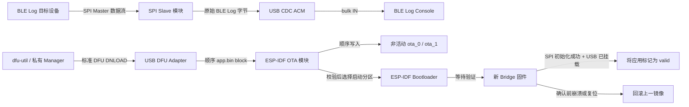
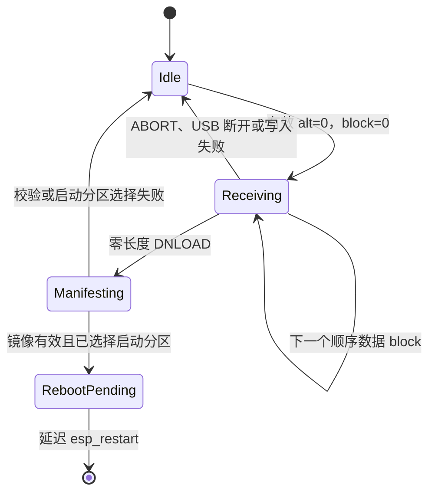

# ESP32-P4 BLE Log Bridge 固件设计提案

状态：设计提案阶段；本目录目前尚未包含固件实现。

方案来源：[ble_log_bridge_manager 工作项 #1](https://gitlab.espressif.cn:6688/ble_tools/ble_log_bridge_manager/-/work_items/1)

## 1. 目标

构建一个 ESP32-P4 固件，实现以下能力：

1. 保留现有 SPI Slave 到 USB CDC 的 BLE Log 字节流；
2. 在同一个 USB 2.0 High-Speed OTG 接口上暴露标准 USB DFU Device Mode；
3. 使用 `esp_ota_*` 将普通 ESP-IDF 应用镜像写入非活动 OTA slot；
4. 仅在完整镜像校验通过后启动新镜像；
5. 如果新镜像无法初始化 SPI Bridge 或完成 USB 枚举，则自动回滚；
6. 当一台 PC 同时连接多个相同 Bridge 时，仍可稳定选择其中指定设备。

常规升级路径采用应用层 USB DFU。ROM DFU 仅用于生产引导或最后的恢复手段，不属于日常设备管理流程。

## 2. 现有基线与约束

`usb_spi_slave_bridge/` 中的现有原型：

- 目标芯片为 ESP32-P4，使用 ESP-IDF `v6.2-dev-964-g49d191730e9`；
- 使用 `espressif/esp_tinyusb` `1.7.6~2` 和 TinyUSB `0.18.0~5`；
- 使用 ESP32-P4 High-Speed USB 控制器；
- 通过 MOSI GPIO 4、SCLK GPIO 5 和 CS GPIO 6 接收 SPI2 Slave 数据；
- 预排队 32 个 DMA transaction，每个 receive buffer 为 10 KiB；
- 将每个完成的 SPI transaction 转发到 TinyUSB CDC ACM；
- 枚举为 Espressif VID `0x303A`、PID `0x4001`；
- 使用 2 MiB、单应用分区配置，无法支持本 OTA 设计。

`components/ble_log_console` 中现有 PC 接收器通过 VID/PID `303A:4001` 识别 Bridge。Windows 上打开 CDC 端口；Linux 和 macOS 上查找 bulk-IN endpoint。因此，增加 DFU interface 时必须保留 VID/PID、CDC interface 编号和 CDC bulk endpoint 地址。

当前锁定的 `esp_tinyusb` 版本没有 `TINYUSB_DEFAULT_CONFIG()` 宏，并且在启用 DFU 后不允许使用默认 configuration descriptor。固件必须显式提供 Full-Speed 和 High-Speed configuration descriptor。实现 USB OTA 不要求升级现有依赖。

## 3. 范围

### 3.1 包含范围

- 仅支持 ESP32-P4。
- SPI Slave 接收和 USB CDC 转发。
- 一个同时包含 CDC ACM 和 DFU Device Mode 的 USB composite configuration。
- 仅支持下载的 DFU alternate setting 0。
- 将 `app.bin` 顺序传输至非活动 OTA application slot。
- Boot partition 选择、首次启动确认和 Bootloader 回滚。
- 每台设备稳定且唯一的 USB serial number。
- 基于 ESP-IDF 安全能力的开发配置和签名部署配置。

### 3.2 不包含范围

- 将 ROM DFU 作为常规升级路径。
- DFU Upload。
- 由主机指定 Flash 地址或分区。
- 通过 OTA 更新 Bootloader、partition table、NVS 或任意数据分区。
- 中断传输续传。
- 独立 recovery application 分区。
- USB 主机身份认证或链路加密。
- BLE Log Bridge Client/Server 或其他 PC 端设备管理代码。
- 自定义 Vendor USB 管理协议。

如果产品后续明确要求“主应用无法启动时仍可恢复”，可以增加独立、固定且已签名的 recovery application。第一版有意不加入该能力，因为它会额外引入一个镜像、一个分区、一条启动路径和一套恢复策略。

## 4. 系统架构



`app_main` 之后只有三个运行时模块：

| 模块 | 调用方使用的接口 | 隐藏的实现 |
|---|---|---|
| `spi_bridge` | 启动 Bridge；启用或禁用 CDC 转发；报告初始化结果 | SPI bus/slave 配置、DMA transaction 所有权、接收任务、CDC queue 写入 |
| `usb_device` | 安装 composite USB device | device/configuration/string/qualifier descriptor、稳定 serial 生成、TinyUSB 与 CDC 初始化、mount/unmount callback |
| `usb_ota` | 确认健康启动；断开连接时终止活动 session | TinyUSB DFU callback、OTA session 状态、block 校验、`esp_ota_*`、DFU 状态映射、延迟重启 |

`app_main` 仅作为 composition root：

1. 初始化 `spi_bridge`；
2. 初始化 `usb_ota` 状态；
3. 最后安装 `usb_device`，确保 Bridge 就绪前主机请求不会进入设备。

USB descriptor 是较长的声明式数据，可以放在私有 `usb_descriptors.c` 中。它不构成独立的公开接口，也不引入通用 descriptor builder。

目标工程结构如下：

```text
components/ble_log_bridge_firmware/
├── DESIGN.md
├── CMakeLists.txt
├── sdkconfig.defaults
├── partitions.csv
└── main/
    ├── CMakeLists.txt
    ├── idf_component.yml
    ├── Kconfig.projbuild
    ├── main.c
    ├── spi_bridge.c
    ├── spi_bridge.h
    ├── usb_device.c
    ├── usb_device.h
    ├── usb_descriptors.c
    ├── usb_ota.c
    └── usb_ota.h
```

仓库根目录下的 `usb_spi_slave_bridge/` 仅作为原型输入，不应成为需要长期维护的第二份固件。实现后的固件只保留 `components/ble_log_bridge_firmware` 这一个正式位置。

## 5. USB 接口契约

### 5.1 设备身份

| 字段 | 值 | 原因 |
|---|---|---|
| VID | `0x303A` | 保留现有 Espressif 设备身份及 Console 发现逻辑 |
| PID | `0x4001` | 保留现有 Bridge 发现逻辑和 CDC 驱动关联 |
| Product | `USB-SPI-BRIDGE` | 避免产生用户可见的兼容性变化 |
| Serial | 从 ESP32-P4 Base MAC 派生的 12 位十六进制字符串 | 多个同型号设备并存时可稳定选择指定 Bridge |
| `bcdDevice` | 固件 release major/minor 的 BCD 表示，初始为 `0x0100` | 无需 Vendor 协议即可发现粗粒度版本 |
| USB version | `0x0200` | USB 2.0 device |

Serial 字符串必须在 OTA 前后保持不变，并且每块开发板都不同。原型中 `123456` 这类构建期常量不可接受，因为 `dfu-util` 和未来的私有 Manager 需要在 USB 重新枚举后继续选择同一台 Bridge。

### 5.2 Composite configuration

设备仅提供一个 configuration，共三个 interface：

| Interface | 功能 | Alternate setting | Endpoint |
|---|---|---|---|
| 0 | CDC ACM control，位于 CDC IAD 中 | 0 | notification IN `0x81` |
| 1 | CDC ACM data | 0 | bulk OUT `0x02`、bulk IN `0x82` |
| 2 | DFU Device Mode | 仅 0：`Application Firmware` | 无；DFU 使用 endpoint 0 control transfer |

Device class/subclass/protocol 保持 Miscellaneous/Common/IAD，使操作系统继续正确绑定两个 CDC interface。

Full-Speed 和 High-Speed descriptor 的总长度必须一致，仅在 USB 速率要求不同的字段上存在差异：

- CDC bulk 最大 packet：Full-Speed 为 64 bytes，High-Speed 为 512 bytes；
- DFU transfer size：两种速率均为 4096 bytes。

同时提供匹配的 device qualifier。`esp_tinyusb` 根据提供的 FS 和 HS descriptor 生成 other-speed response。

DFU functional descriptor 配置如下：

- `bmAttributes = DFU_ATTR_CAN_DOWNLOAD`；
- 不包含 `DFU_ATTR_CAN_UPLOAD`；
- 不包含 `DFU_ATTR_MANIFESTATION_TOLERANT`，因为 manifestation 成功后设备会复位；
- 仅有一个 alternate setting；
- `wTransferSize = 4096`；
- `bcdDFUVersion = 1.1`，由 TinyUSB 的 `TUD_DFU_DESCRIPTOR` 生成。

不使用 DFU Runtime interface，也不会重启进入 ROM DFU。正常应用本身就是 DFU target。

DFU 不增加 bulk endpoint，因此现有非 Windows BLE Log Console 仍会找到同一个 CDC bulk-IN endpoint。CDC 保持 interface 0/1，也可以避免改变 Windows 上的 CDC interface 身份。

### 5.3 主机驱动策略

- Linux：主机安装包提供所需 udev 权限规则。
- macOS：`dfu-util` 通过 libusb 访问 interface 2。
- Windows：CDC 继续绑定 `usbser`；interface 2 需要配置为 WinUSB，供 `dfu-util` 使用。

第一版暂不加入 Microsoft OS descriptor 和 WinUSB 自动绑定。对于初期受控的 QA 环境，一次性安装驱动更简单且足够使用。只有当主机环境初始化成为实际运维问题时，再增加 OS descriptor。

## 6. DFU 到 OTA 的更新 session

### 6.1 状态模型



OTA session 持有以下状态：

- 当前状态；
- target partition 指针；
- OTA handle 是否有效；
- 下一个预期 block number；
- 已接收总字节数；
- CDC 转发是否暂停。

必须始终满足以下不变量：

1. OTA handle 仅在 Receiving 或 Manifesting 状态有效，并且必须且只能由 `esp_ota_end()` 或 `esp_ota_abort()` 关闭一次；
2. target 始终由 `esp_ota_get_next_update_partition(NULL)` 选择，主机不能指定；
3. target 永远不是当前运行分区；
4. `received_bytes` 永远不超过 target partition 大小；
5. 仅当 `esp_ota_write()` 成功后，预期 block 才前进；
6. 仅当 `esp_ota_end()` 成功后，才能调用 `esp_ota_set_boot_partition()`。

### 6.2 第一个数据 block

收到第一个非空 `DFU_DNLOAD` callback 时：

1. 要求 `alt == 0`；
2. 要求 `block_num == 0`；
3. 要求 `0 < length <= 4096`；
4. 使用 `esp_ota_get_next_update_partition(NULL)` 选择非活动 OTA slot；
5. 验证存在可用的 OTA application partition；
6. 使用 `esp_ota_begin(target, OTA_WITH_SEQUENTIAL_WRITES, &handle)` 开始增量擦除和写入；
7. 以原子方式暂停 CDC 转发；
8. 使用 `esp_ota_write()` 写入 block；
9. 仅在写入成功后，通过 `tud_dfu_finish_flashing(DFU_STATUS_OK)` 报告成功。

`OTA_WITH_SEQUENTIAL_WRITES` 避免在首次响应前擦除整个 slot，并且与 DFU 的顺序数据流一致。

### 6.3 后续数据 block

收到每个后续非空 block 时：

1. 要求当前存在活动的 Receiving session；
2. 要求 `alt == 0`；
3. 要求 `block_num == expected_block`；
4. 写入前拒绝 `received_bytes + length > target->size`；
5. 调用 `esp_ota_write()`；
6. 仅在成功后更新计数器。

乱序、重复、跳号、超分区或非零 alt 的数据不得写入 Flash。

TinyUSB manifestation callback 会提供 alternate setting，但不会提供最终零长度请求的 block number。因此，固件校验所有带数据的 block，但不声称校验当前 TinyUSB 接口未提供的最终 block number。

### 6.4 Manifestation

收到零长度 DNLOAD manifestation callback 时：

1. 要求 `alt == 0`、存在活动 session，且已写入至少一个字节；
2. 调用 `esp_ota_end(handle)`，完成 Flash Encryption 收尾，并校验完整 ESP 镜像以及启用 Secure Boot 时的签名；
3. 校验成功后调用 `esp_ota_set_boot_partition(target)`；
4. 在断开连接前向主机报告最终 DFU 状态；
5. 保持 CDC 转发禁用；
6. 启动一次性 `esp_timer`，确保最终 control response 有时间到达主机后再调用 `esp_restart()`。

初始重启延迟为 500 ms。该参数受硬件和主机兼容性影响，应保持可配置，以便在不同 USB hub 和操作系统上测试。

如果 `esp_ota_end()` 失败，其 handle 已经失效，不能再次调用 abort。如果 boot partition 选择失败，当前启动配置继续生效。两类失败都不能启动候选镜像。

### 6.5 Abort 和断开连接

在 Receiving 状态下，`tud_dfu_abort_cb()` 和 USB unmount 执行相同清理流程：

1. abort 有效的 OTA handle；
2. 清空 session 元数据；
3. 恢复 CDC 转发。

DFU DETACH 请求不会使设备重启进入 ROM DFU。在这个始终存在的 DFU Device Mode 中，Idle 状态下忽略 DETACH；存在活动传输时，将其视为取消操作。

Boot partition 选择成功后，不允许取消操作撤销结果。`RebootPending` 状态下断开连接或掉电，只会使设备在下次启动时尝试已选择的新镜像。

第一版不支持断点续传，也不增加固件侧 inactivity watchdog。主机取消操作时必须发送 DFU ABORT；重试前必须重置 DFU 状态。只有当真实 Manager 崩溃导致仍供电设备频繁卡在 DFU session 时，才增加基于 inactivity 的强制 USB reset。

### 6.6 DFU 状态映射

| 条件 | DFU status |
|---|---|
| 非零 alternate 或无可用 target | `DFU_STATUS_ERR_TARGET` |
| 首字节非法或镜像格式错误 | `DFU_STATUS_ERR_FILE` |
| block 跳号、重复或乱序 | `DFU_STATUS_ERR_NOTDONE` |
| 镜像超过 slot 大小 | `DFU_STATUS_ERR_ADDRESS` |
| Flash 擦除失败 | `DFU_STATUS_ERR_ERASE` |
| Flash 写入失败 | `DFU_STATUS_ERR_WRITE` |
| `esp_ota_end()` 镜像或签名校验失败 | `DFU_STATUS_ERR_VERIFY` |
| Boot partition 选择失败 | `DFU_STATUS_ERR_FIRMWARE` |
| 未映射的内部失败 | `DFU_STATUS_ERR_UNKNOWN` |

每个启动 TinyUSB flashing operation 的 callback 都必须且只能调用一次 `tud_dfu_finish_flashing()`。

当前锁定的 TinyUSB DFU 实现会接受原始 `SET_INTERFACE` 值，而不检查 descriptor 中声明的 alternate 数量。固件仍会拒绝所有 `alt != 0` 的数据 callback，正常的 `dfu-util -a 1` 枚举也找不到该 alternate。如果 USB 一致性要求原始非零 `SET_INTERFACE` 请求本身必须 STALL，应升级或修复 TinyUSB，而不是再增加一套固件侧协议。

### 6.7 Poll 时序

`tud_dfu_get_timeout_cb()` 用于告知主机再次 poll 前应等待多久。初始值为：

- 数据 block：10 ms；
- Manifestation：1000 ms。

这些值只是调优起点，不是正确性超时。必须在开启 Secure Boot 和 Flash Encryption 的真实 Flash 上测量：每个 block 的等待值过大会直接降低吞吐，过小则会造成不必要的主机 poll。在实测证明有必要前，只保留这两个可配置参数，不提前引入异步写入 queue。

## 7. 与 BLE Log 数据流的交互

DFU session 期间，SPI Slave task 继续完成并重新排队 DMA transaction，使目标设备的 SPI Master 不会死锁；但会主动丢弃 transaction payload，不再写入 CDC。

该策略具有三个作用：

- Flash 操作不会与持续增长的 CDC queue 竞争；
- 目标设备无需等待 Bridge，可以继续运行；
- 更新或 abort 后不会向主机突发发送过期日志。

SPI task 和 TinyUSB task 可能运行在不同 CPU core，因此转发开关必须是原子的。它不需要额外 queue、callback 抽象或全局锁。

OTA 期间产生的 BLE Log 会被有意丢弃。PC Manager 应在启动 `dfu-util` 前停止采集；固件不得向 CDC BLE Log 流注入 OTA 文本或状态字节，否则会破坏接收器的二进制 framing。

发生 abort、校验失败或 boot partition 选择失败时恢复转发。Manifestation 成功后继续禁用转发，直到设备重启。

第一版保持现有 SPI GPIO、queue 和 buffer 默认值不变。USB OTA 不应与无关的 Bridge 吞吐重构耦合。

## 8. 分区与启动契约

支持的固件构建使用自定义 OTA partition table，并且不设置 factory application：

```csv
# Name,    Type, SubType, Offset, Size, Flags
nvs,       data, nvs,     0x9000, 64K,
otadata,   data, ota,             8K,
ota_0,     app,  ota_0,            6M,
ota_1,     app,  ota_1,            6M,
```

具体 slot 大小属于开发板 SKU 配置，但必须满足以下固定约束：

- `otadata` 为 8 KiB；
- 至少有两个 OTA application slot；
- 两个 OTA slot 大小相同；
- 每个 slot 都能容纳最大签名应用镜像及预留增长空间；
- 应用镜像不能写出所选 slot；
- 常规 USB OTA 永远不修改该 partition table。

在包含 Bootloader、partition table、NVS、对齐空间和 OTA metadata 后，Issue 中两个 6 MiB slot 至少需要 16 MiB Flash SKU。原型当前的 `CONFIG_ESPTOOLPY_FLASHSIZE="2MB"` 和 single-app partition table 不可复用。在确定 `partitions.csv` 和 `CONFIG_ESPTOOLPY_FLASHSIZE` 前，必须核实 QA 开发板的真实 Flash 容量。

由于本 DFU 路径有意禁止更新 partition table，因此分区布局是长期设备兼容性契约。应在批量 bootstrap 前确定 slot 大小，而不是按照当前约 250 KiB 的原型镜像做最小化配置。

必须启用以下配置：

```text
CONFIG_PARTITION_TABLE_CUSTOM=y
CONFIG_BOOTLOADER_APP_ROLLBACK_ENABLE=y
CONFIG_TINYUSB_RHPORT_HS=y
CONFIG_TINYUSB_CDC_ENABLED=y
CONFIG_TINYUSB_DFU_MODE_DFU=y
CONFIG_TINYUSB_DFU_BUFSIZE=4096
```

## 9. 首次启动确认与回滚

Bootloader 以 `ESP_OTA_IMG_PENDING_VERIFY` 状态启动新选择的镜像。

只有同时满足以下两个条件，才确认新镜像有效：

1. SPI Slave 初始化成功；
2. Composite USB device 已达到 TinyUSB mounted/configured 状态。

初始化顺序保证 TinyUSB 可能 mount 之前，SPI 条件已经成立。USB mount callback 检查当前运行分区状态，并且只在状态为 `ESP_OTA_IMG_PENDING_VERIFY` 时调用 `esp_ota_mark_app_valid_cancel_rollback()`。

这个健康门槛证明两个对外有用的 Bridge 路径均已完成初始化，但不要求 BLE Log 目标设备正在实际发送数据。如果要求出现真实 SPI 流量，目标设备未上电时会导致健康的 Bridge 错误回滚。

如果新镜像在 USB mount 和确认前崩溃、触发 watchdog、初始化失败或复位，Bootloader 会回滚到上一个有效 slot。设备在没有 USB Host 的情况下上电会保持 pending；如果从未完成枚举就再次复位，发生回滚是预期行为，因为其唯一管理接口尚未被证明可用。

## 10. 掉电行为

| 故障点 | 持久化结果 | 下次启动或运行结果 |
|---|---|---|
| OTA 开始前 | 无变化 | 当前镜像继续运行 |
| 擦除或写入非活动 slot 时 | 仅留下不完整的非活动镜像 | 当前镜像仍可启动 |
| 最后一个 block 后、`esp_ota_end()` 成功前 | 候选镜像未被选择 | 当前镜像继续运行 |
| 镜像无效、截断、随机、芯片错误或签名错误 | 校验失败，候选镜像未被选择 | 当前镜像运行，Bridge 恢复转发 |
| `esp_ota_end()` 后、选择 boot partition 前 | 存在有效镜像数据，但未被选择 | 当前镜像继续运行 |
| 更新冗余 `otadata` 时 | ESP-IDF 选择有效的 metadata sector | 旧或新启动选择至少一个保持有效 |
| 选择 boot partition 后、延迟重启前 | 新镜像已被选择 | 新镜像以 pending verification 状态启动 |
| 新镜像确认前崩溃或复位 | Bootloader 将其标记为本次不可继续使用 | 上一个有效镜像启动 |
| 新镜像确认后 | 新镜像已标记 valid | 后续复位继续运行新镜像 |

固件不自行实现 journal、checksum、签名算法、加密层或回滚 metadata。这些职责全部交给 ESP-IDF。

## 11. 安全模型

标准 DFU 不认证 PC 或操作人员身份。任何能够物理访问 USB 的人都可以请求下载固件。

因此，部署安全依赖 ESP-IDF：

- Secure Boot V2 保证只接受正确签名的应用镜像；
- Flash Encryption 保护静态数据，由 `esp_ota_write()` 处理；
- 需要禁止旧漏洞版本时，anti-rollback `secure_version` 阻止安装旧但签名有效的镜像；
- DFU Upload 始终禁用。

Flash Encryption 不会加密 USB 线上的传输。如果未来必须认证操作人员或保护传输机密性，标准 DFU 就不适合作为承载该能力的接口；应改用带认证的 Vendor 协议，或在应用中增加启用 DFU 前的授权步骤。不要在 DFU 模块中重复实现密码学。

可以先在未签名开发板上验证 USB 稳定性和掉电行为。只有在真实、已启用 eFuse 的开发板上验证 Secure Boot 和错误签名镜像拒绝行为后，受管 QA 部署才能将 USB OTA 视为可信升级路径。

## 12. 主机接口契约

主机发送普通 application binary，而不是 ROM DFU archive：

```bash
idf.py build
dfu-util -l
dfu-util -d 303a:4001 -S <bridge-serial> -a 0 \
  -D build/ble_log_bridge_firmware.bin
```

不得发送为 ROM DFU 生成的 `build/dfu.bin`。该格式可能包含多个镜像和多个 Flash 地址，而本接口只接受一个顺序 ESP application image。

当同时存在多个 Bridge 时，稳定 USB serial 是必需条件。私有 Manager 负责：

1. 停止指定 serial 对应的采集进程；
2. 对 interface 2、alternate 0 发起 DFU；
3. 等待同一 serial 断开并重新枚举；
4. 上报 `dfu-util` 结果和启动后设备是否重新出现。

HTTP Client/Server 管理平面和固件包分发仍位于本仓库范围之外。

## 13. 存量设备 bootstrap 约束

所有当前运行 single-app 原型固件的开发板，都需要执行一次 bootstrap 烧录，并同时写入以下内容：

- 支持 OTA rollback 的 Bootloader 配置；
- 新的双 slot partition table；
- 第一个支持 USB OTA 的 Bridge application。

现有固件没有 DFU interface，无法通过 USB 安装该布局；本方案中的应用层 DFU 也有意禁止更新 Bootloader 和 partition table。因此，现有 QA 开发板仍需要进行最后一次 UART、USB-Serial-JTAG 或生产烧录。完成这次 bootstrap 后，后续应用更新才可以只使用 USB 2.0 HS 接口。

未来修改 partition table 时也受同一约束。批量 bootstrap 后应避免再次修改分区布局。

## 14. 验证契约

只有当实现能在真实硬件上证明以下可观察行为时，本设计才算完整落地。

### 14.1 USB 与兼容性

- VID/PID 保持 `303A:4001`。
- CDC 保持 interface 0/1 和现有 endpoint 地址。
- DFU 使用 interface 2，并且仅提供 `alt=0: Application Firmware`。
- FS、HS、qualifier、configuration length 和 other-speed descriptor 通过枚举检查。
- 现有 BLE Log Console 在 Windows、Linux 和 macOS 上仍能正常采集。
- 同时连接的两个 Bridge 具有不同且稳定的 serial，并可被独立选择。
- DFU Upload、`dfu-util -a 1` 和基于地址的 DfuSe 操作均不能写入 Flash。

### 14.2 成功升级与回滚

- 使用普通 application binary 完成 A 到 B、B 到 C 的连续升级。
- 设备在断开连接前向主机报告 DFU 成功。
- 重启后，同一个 serial 重新枚举。
- 首次健康启动被标记为 valid，后续复位不再回滚。
- 故意构造的崩溃、watchdog reset 或初始化失败镜像会自动回滚。

### 14.3 故障注入

- 在约 10%、50% 和 manifestation 前一刻切断 USB 电源。
- 测试截断、随机、芯片错误、超分区、未签名和签名错误镜像。
- 分别在 boot partition 选择前后中断升级。
- Abort 更新，并验证 CDC 转发恢复。
- 更新期间持续产生 SPI 流量，验证 SPI Master 不死锁，更新结束后不会发送过期数据。

### 14.4 环境矩阵

- Windows：CDC 与 DFU interface 上的 WinUSB 并存。
- Linux：配置 udev 权限。
- macOS：使用 libusb。
- High-Speed 和 Full-Speed fallback。
- 具有代表性的 QA USB hub、线材和多设备同时连接场景。
- 未签名 OTA 行为稳定后，在真实启用 Secure Boot V2 和 Flash Encryption eFuse 的开发板上验证。

## 15. 有意推迟的能力

| 推迟项 | 仅在以下条件出现时增加 |
|---|---|
| 独立 recovery/test application | 明确要求主应用不可启动时仍能恢复 |
| 可续传 OTA | 实测更新中断率足以支持增加持久化进度 metadata 和主机支持 |
| 异步 Flash worker | 实测同步 Flash 延迟破坏 USB control 时序或目标吞吐 |
| Microsoft OS descriptor | 一次性 WinUSB 初始化在运维上不可接受 |
| 带认证的 Vendor 协议 | 签名镜像校验仍不足以满足操作人员身份认证或传输保密要求 |
| 固件 inactivity watchdog | 真实主机崩溃频繁导致仍供电 Bridge 卡在 DFU session，值得强制 USB reset |
| 固件管理或状态协议 | 私有 Manager 出现 USB serial、`bcdDevice`、DFU status 和重新枚举无法提供的明确字段需求 |
