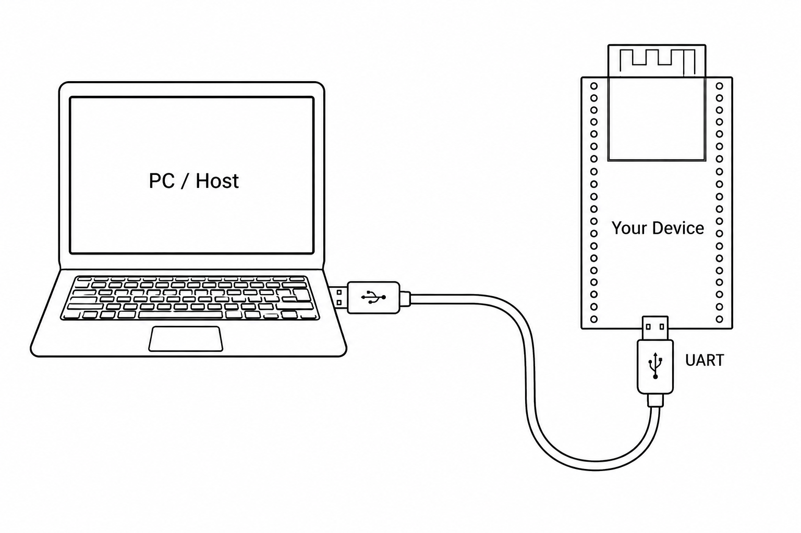
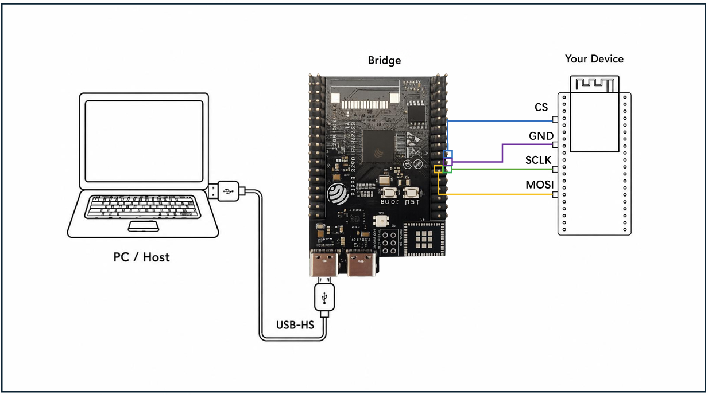
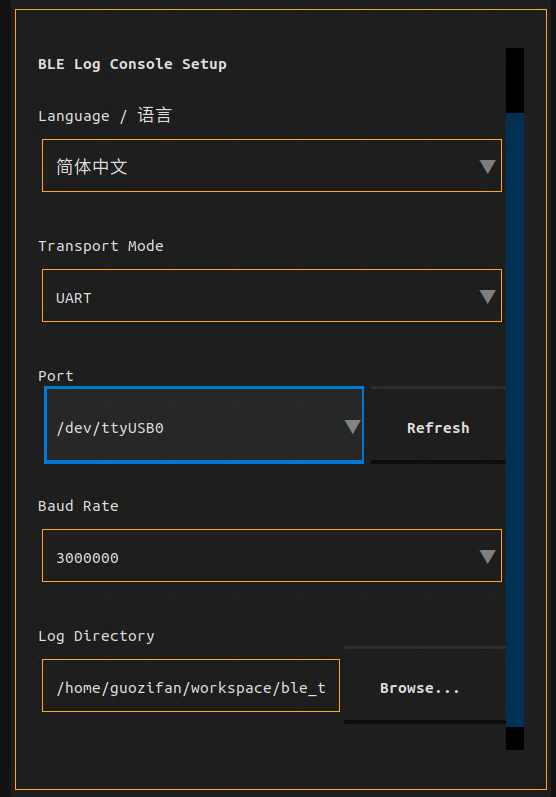
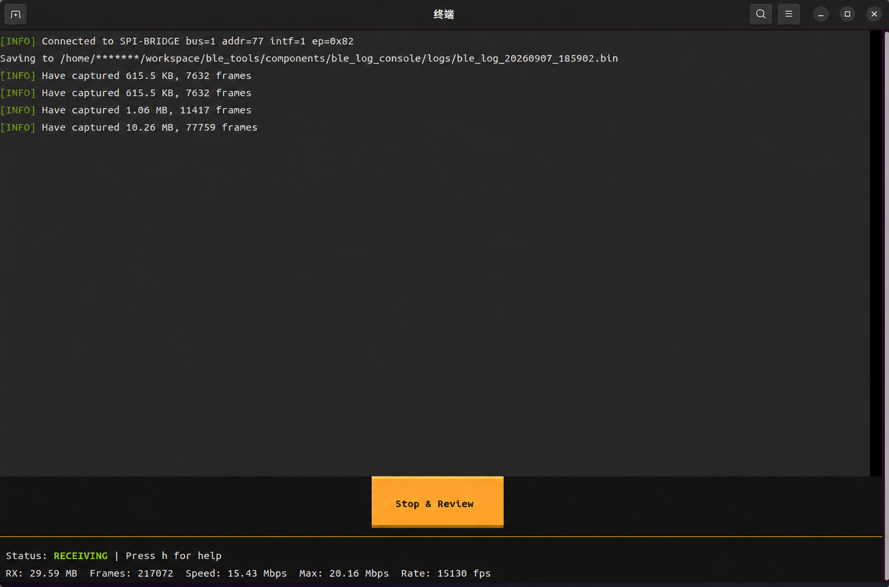

# BLE Log Console Quick Start Guide
Version: v1.0.2

## Introduction

BLE Log Console is a terminal tool for receiving, displaying, and saving ESP BLE logs in real time. It supports two transport modes: UART and SPI Bridge.

## 1. Preparation

Before starting, confirm three things: BLE Log is enabled in the firmware, the hardware is wired correctly, and the PC-side tool can run.

Jump directly to the transport mode you want to use:

* [UART Mode](#2-uart-mode)
* [SPI Bridge Mode](#3-spi-bridge-mode)

## 2. UART Mode

Device connection diagram:

<p align="center">
  
</p>

### 2.1 Firmware Configuration

- Enable `CONFIG_BT_LOG_CRITICAL_ONLY` in the existing project, and configure the related options as follows:
  - `CONFIG_BLE_LOG_PRPH_UART_DMA=y`
  - `CONFIG_BLE_LOG_PRPH_UART_DMA_PORT=0`
  - `CONFIG_BLE_LOG_PRPH_UART_DMA_BAUD_RATE=3000000`
  - `CONFIG_BLE_LOG_PRPH_UART_DMA_TX_IO_NUM=0`
- Confirm that UART TX is connected to the PC-side serial port RX.
- Build and flash the firmware.

> Notes:
> - `CONFIG_BLE_LOG_PRPH_UART_DMA_TX_IO_NUM` sets the GPIO corresponding to the **UART TX signal**. The default value is `0`.
> - If UART0 is already occupied by another function, adjust `CONFIG_BLE_LOG_PRPH_UART_DMA_PORT` according to the actual hardware connection to avoid affecting existing functionality.
> - `CONFIG_BLE_LOG_PRPH_UART_DMA_BAUD_RATE` is the baud rate used by UART to output BLE logs. The baud rate selected in the PC-side `ble_log_console` must match this value.

### 2.2 Start the Application on the PC

- For Windows instructions, see [Windows System](#411-windows-system).
- For Linux instructions, see [Linux System](#412-linux-system).

## 3. SPI Bridge Mode

Device connection diagram:

```text
ESP device  ->  BLE Log SPI USB Bridge  ->  PC
```

<p align="center">
  
</p>

**How do I get a Bridge device?**

The Bridge device forwards **BLE SPI Log data generated by your device** to the PC. It is currently supported by our `ESP32P4` product. You can get a Bridge device in either of the following ways:

* Flash it yourself: If you have an `ESP32P4` development board, connect it through a USB serial port and flash it on the [Bridge firmware download](https://espressif.github.io/esp-launchpad/?flashConfigURL=https://dl.espressif.com/ble/ble_log/spi_bridge_bin/launchpad.toml&crossDomain=true) page. After flashing, it can be used as a Bridge device.

* Apply for or purchase one officially: If you do not have an `ESP32P4` device that can be used as a Bridge, but you do need to use SPI Bridge mode, you can purchase one through official channels or apply for a trial device through technical support.

> Note: The Bridge device is an additional adapter device. It cannot be the same device that generates BLE Log data.

### 3.1 Firmware Configuration

- Enable `CONFIG_BLE_LOG_ENABLED` in the existing project, and also enable the following related option:
  - `CONFIG_BLE_LOG_PRPH_SPI_MASTER_DMA=y`
- Configure the following GPIO numbers according to the actual circuit:
  - `CONFIG_BLE_LOG_PRPH_SPI_MASTER_DMA_MOSI_IO_NUM`
  - `CONFIG_BLE_LOG_PRPH_SPI_MASTER_DMA_SCLK_IO_NUM`
  - `CONFIG_BLE_LOG_PRPH_SPI_MASTER_DMA_CS_IO_NUM`
- Connect the corresponding GPIOs to the SPI Bridge:
  - `MOSI_IO_NUM` to `Bridge IO 4`
  - `SCLK_IO_NUM` to `Bridge IO 5`
  - `DMA_CS_IO_NUM` to `Bridge IO 6`
  - Connect the GND pins of both devices
- Build and flash the firmware.

> Notes:
> - **The GPIO configuration above must match the actual wiring**.
> - If the GND pins of the two devices are not connected correctly, data reception may be abnormal.
> - `CONFIG_BLE_LOG_ENABLED` is the global BLE Log switch. If it is not enabled, the PC side will not receive BLE log data.

### 3.2 Start the Application on the PC

- For Windows instructions, see [Windows System](#411-windows-system).
- For Linux instructions, see [Linux System](#412-linux-system).

## 4. First Run and Startup

### 4.1 Get the Tool

The tool package provides applications for different operating systems.

#### 4.1.1 Windows System

On Windows, use `ble_log_console_windows.exe`. The recommended way to start it is to double-click the icon.

> Note: This tool package currently supports `Windows 10` and later.

#### 4.1.2 Linux System

On Linux, use `ble_log_console_ubuntu`. If the file does not have execute permission, enter the corresponding directory first and run:

```bash
chmod +x ./ble_log_console_ubuntu
```

If you plan to use SPI Bridge on Linux, run the following command before the first use:

```bash
sudo ./ble_log_console_ubuntu
```

This command installs the USB access permission rules required by SPI Bridge. After the command finishes, unplug and reconnect the SPI Bridge device once. After that, `sudo` is no longer required for normal use.

Then run the following command to start the program:

```bash
./ble_log_console_ubuntu
```

> This tool package currently supports `Ubuntu 22.04` and later.

### 4.2 Application Guide

After startup, the application displays the following screen:

<p align="center">
  
</p>

First, select the transport mode. Select UART if you receive logs through a serial port, or SPI Bridge if you receive logs through an SPI Bridge device. After the mode is selected, the application automatically scans the available ports.

Then select the port. In UART mode, you also need to select the baud rate, which must match the firmware configuration. Next, specify the log save path. By default, logs are saved to the `logs` directory under the current directory. If this directory does not exist, it is created automatically. Finally, click Connect to start receiving logs.

After log reception is complete, press `q` or `Ctrl+C` to exit the application. Logs are automatically saved in the configured directory. Large captures may be split into multiple `part` files, and the exit message summarizes the saved files.

> Note: When stopping capture, use `q` or `Ctrl+C` to exit the application normally. If the terminal window is closed directly, the process may be terminated by the system, which may cause some logs to be lost.

Note that in a Linux environment, the available port name formats for SPI mode and UART mode are different. This is determined by the transport modes themselves and does not affect usage.

## 5. User Interface and Log Files

### 5.1 Interface Description

After startup, the interface mainly consists of the log area and the status bar, as shown below.

<p align="center">
  
</p>

The log area displays parsed BLE logs, tool prompts, and warning messages in real time.

The status bar shows the current connection status, amount of received data, current speed, peak speed, frame rate, and lost-frame statistics.

The tool supports adaptive window resizing. When the window is small, some status information may be temporarily incomplete. Enlarge the window as needed, or scroll to view the remaining information.

### 5.2 Normal Status

As shown in the interface above, the `frames` statistic at the red arrow indicates the number of parsed `BLE log frame` entries. The `RX` value on the left indicates the amount of parsed log data. When `RX` reaches a certain size, the prompt at the blue arrow appears.

**Normal status:** During use, if the `frames` value at the red arrow keeps increasing, the transfer speed is **not 0**, and the **size prompt** at the blue arrow appears, the tool is running normally.

> If the connection is normal but the indicators above are abnormal, check whether the `BLE Log` module is enabled properly and whether the wiring is fully correct.

### 5.3 Common Shortcuts

The following shortcuts are commonly used while the application is running. They can be used to view statistics, reset the device, exit the application, and more.

| Key | Function |
| --- | --- |
| `q` | Exit |
| `Ctrl+C` | Exit |
| `c` | Clear the log area |
| `s` | Toggle auto-scroll |
| `d` | View received log statistics |
| `m` | View buffer usage |
| `h` | Show shortcut help |
| `r` | Reset the target device; not supported in SPI Bridge mode |

## 6. Run from Source

The tool also provides source code for users who need local debugging, temporary tool changes, or feature verification.

### 6.1 Get the Source

The source code is located in the BLE Log Console source directory. Enter this directory first:

```bash
cd <ble_log_console source directory>
```

The main files and directories are:

| File or Directory | Description |
| --- | --- |
| `console.py` | Application entry point |
| `install.sh` | Linux source environment setup script |
| `run.sh` | Linux source startup script |
| `install.bat` | Windows source environment setup script |
| `run.bat` | Windows source startup script |
| `src/` | Tool source code |
| `tests/` | Unit tests |
| `logs/` | Default log output directory, created automatically after running |

> Notes:
> - For normal use, the packaged executable is recommended.
> - Source startup is mainly intended for local debugging, temporary logic changes, or new feature verification.

### 6.2 Use the Source

Source startup is basically the same as using the packaged program. Run the install script once to prepare the local environment, then use the startup script to start `console.py`.

#### 6.2.1 Windows System

On Windows, enter the source directory and prepare the environment once:

```bat
.\install.bat
```

Then run:

```bat
.\run.bat
```

Running without parameters opens the interactive interface. You can select the transport mode, port, baud rate, and log save directory in the interface.

You can also start a specified mode directly with command-line parameters:

```bat
.\run.bat --mode uart --port COM3 --baudrate 3000000
.\run.bat --mode spi --port <PORT>
```

#### 6.2.2 Linux System

On Linux, enter the source directory and prepare the environment once:

```bash
./install.sh
```

Then run:

```bash
./run.sh
```

If the script does not have execute permission, run:

```bash
chmod +x ./install.sh ./run.sh
```

Command-line startup examples:

```bash
./run.sh --mode uart --port /dev/ttyUSB0 --baudrate 3000000
./run.sh --mode spi --port <PORT>
```

#### 6.2.3 Run `console.py` Directly

If the required Python environment has already been prepared manually, you can run `console.py` directly:

```bash
cd <ble_log_console source directory>
python console.py
```

You can also install the dependencies in a normal Python environment and then run the tool:

```bash
python -m pip install .
python console.py
```

Common commands:

```bash
python console.py --mode uart --port /dev/ttyUSB0 --baudrate 3000000
python console.py --mode spi --port <PORT>
```

> Notes:
> - Running `console.py` directly requires all Python dependencies to be installed.
> - For normal use, run `install.sh` or `install.bat` once, then use `run.sh` or `run.bat`.

## Appendix: Common Commands

This section provides additional usage examples for the tool package. The tool also supports command-line startup. Common commands are listed below.

| Operation | Linux | Windows |
| --- | --- | --- |
| View help | `./ble_log_console_ubuntu --help` | `ble_log_console_windows.exe --help` |
| List ports | `./ble_log_console_ubuntu ports` | `ble_log_console_windows.exe ports` |
| Start interactive mode | `./ble_log_console_ubuntu` | `ble_log_console_windows.exe` |
| Start UART mode | `./ble_log_console_ubuntu --mode uart --port /dev/ttyUSB0` | `ble_log_console_windows.exe --mode uart --port COM3` |
| Start SPI Bridge mode | `./ble_log_console_ubuntu --mode spi --port <PORT>` | `ble_log_console_windows.exe --mode spi --port <PORT>` |
| View saved logs | `./ble_log_console_ubuntu ls` | `ble_log_console_windows.exe ls` |

## Appendix: FAQ

### I plugged in the device, but I still cannot see it in the port list.

Please check:

- Whether the device is wired correctly, including the shared GND connection for SPI.
- Whether the device is powered on.
- Whether the correct firmware is running on the device.
- Whether the port is already occupied by another program.
- On Linux, whether you have run `sudo ./ble_log_console_ubuntu` once and unplugged/reconnected the device after running it.

### The program starts, but no logs appear.

Please check:

- Whether the selected connection mode is correct.
- Whether the selected port is correct.
- Whether BLE Log is enabled in the ESP device firmware.
- In UART mode, whether the baud rate selected in the tool matches the firmware configuration.
- Whether the wiring between the ESP device and the serial port tool or SPI Bridge is correct.
- In SPI Bridge mode, whether the GPIOs corresponding to MOSI, SCLK, and CS in the ESP device firmware match the actual wiring.

### Source environment setup fails.

The source launcher depends on the local Python environment, package index access, and system PATH settings. The install scripts try to prepare these automatically, but different PC environments may need manual setup. The required items are:

- Python 3.10 or later.
- `uv`, available from `PATH`.
- Access to the Python package dependencies declared in `pyproject.toml`.

If the script cannot complete the setup, install the required items manually, then run `uv sync --all-extras` in the source directory before using the launcher script.

### How do I confirm the firmware version flashed on ESP32P4?

The current ESP32P4 Bridge firmware version is `1.0`. The firmware prints version information in the serial log when it starts. To confirm the version, connect the ESP32P4 to the PC through the USB serial port, then open the serial monitor:

```bash
idf.py -p <PORT> monitor
```

If the startup log has already scrolled past, press the reset button on the development board. The version information is printed again after ESP32P4 restarts.

> Note: When checking the version, the ESP32P4 serial port cannot be used by `ble_log_console UART` mode or another serial tool at the same time.
